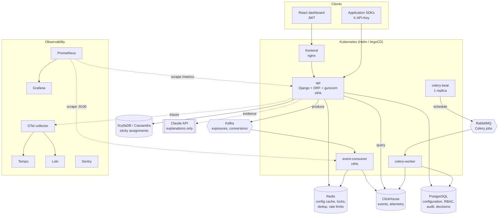
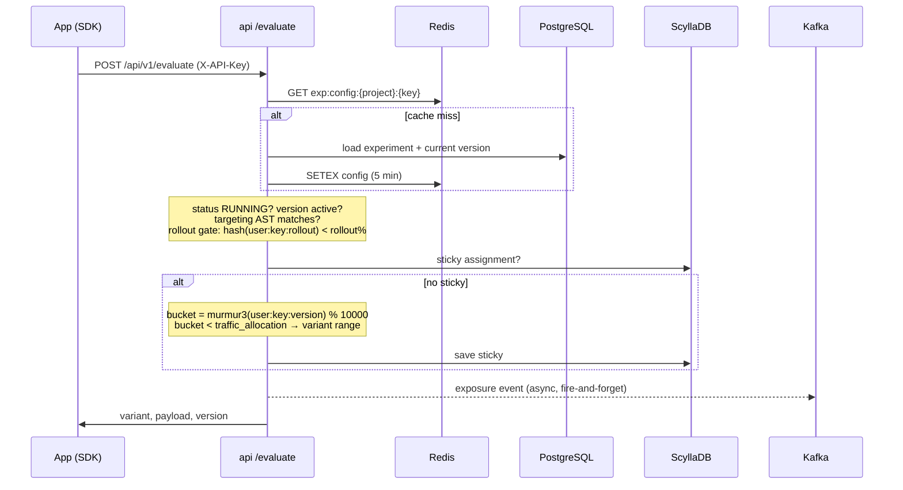
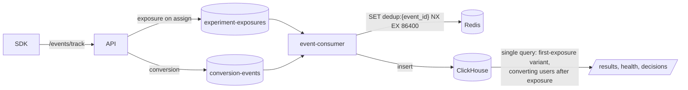
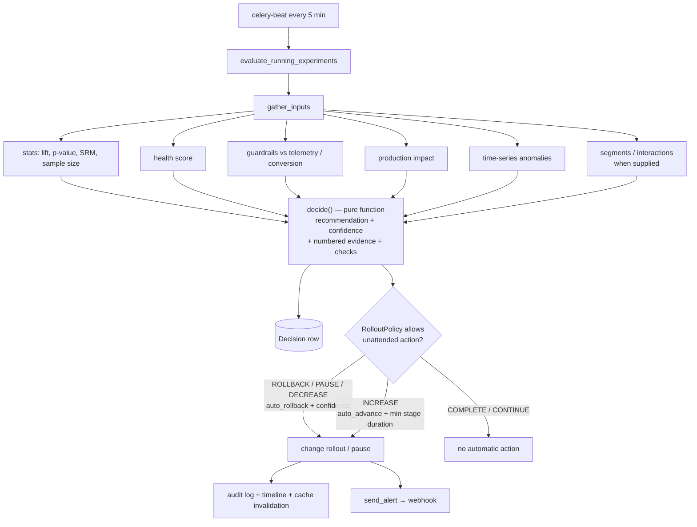

# ExperimentOS Architecture

ExperimentOS is a modular Django monolith plus a small number of separately scaled
processes. Each backing store exists to solve one specific problem (see
[ADRs](adr/)).

## System overview

## Django apps

| App | Responsibility |
|---|---|
| `accounts` | Users, JWT auth, project API keys (SHA-256 hashed) |
| `organizations` | Organizations, projects, memberships and RBAC (`permissions.py`) |
| `experiments` | Experiments, immutable versions, variants, targeting rules, lifecycle state machine |
| `engine` | Targeting evaluator, MurmurHash bucketing, rollout gate, sticky bucketing, Redis cache and locks, evaluate/debug APIs |
| `events` | Kafka producer/consumer, Redis dedup, ClickHouse schema and result queries |
| `stats` | Z-tests, Wilson CIs, relative lift (delta method), SRM chi-square, sample size |
| `intelligence` | Health score, segment analysis + Simpson's paradox, interaction detection, timeline |
| `observability` | Prometheus metrics, OTel tracing, Sentry, production telemetry correlation |
| `decisions` | Guardrails, anomaly detection, decision engine, progressive rollout, rollback, Celery jobs |
| `ai` | Evidence bundles and LLM explanations with template fallback |
| `audit` | Audit log with standardized actions, organization scope and client IP |

## Evaluation hot path

Key properties:

- **Deterministic**: the variant bucket is `murmur3("{user}:{key}:{version}") % 10000`.
- **Sticky**: once assigned, ScyllaDB returns the same variant even after a new version
  changes bucket ranges (unless that variant no longer exists).
- **Monotonic rollout**: the rollout gate hashes `"{user}:{key}:rollout"` (no version), so
  users inside 10% stay inside at 25/50/100%, and a rollback 50% → 10% keeps the original 10%.
  The gate applies before the sticky lookup, so rollbacks take effect for already-assigned users.
- **Degrades gracefully**: Redis errors fall back to PostgreSQL; Kafka errors are logged and
  counted (`errors_total{component="kafka_producer"}`), never surfaced to the SDK.
- The **debugger** (`/evaluate/debug/`) runs the same pipeline with `persist=False` and returns
  every step; it never writes assignments.

## Event pipeline

Exactly-once is approximated with at-least-once delivery plus idempotent processing
(Redis `SETNX` on `event_id`). Known gaps are documented in
[failure-testing.md](failure-testing.md).

## Decision loop

Rule priority inside `decide()`: guardrail breach → critical anomaly → SRM → significant
primary-metric regression → critical production regression → low health → positive path
(increase / complete) → continue. `COMPLETE` is never executed automatically.

## AI layer

The AI layer is an explanation interface over structured evidence, not a decision maker:

1. `build_experiment_evidence()` turns decision checks, results, rollout history, applied
   decisions, timeline and assignment counts into numbered statements `E1..En`.
2. The model (`AI_MODEL`, default `claude-opus-5`) receives only that JSON, must cite
   IDs, and returns structured JSON. Citations to unknown IDs are dropped.
3. Without credentials, on refusal, or on API errors, a deterministic template answer is built
   from the same evidence, so explanations never block on the LLM.

## Security model

- **Authentication**: JWT for the dashboard, hashed API keys for SDK traffic (one key per project).
- **Authorization**: `OrganizationRolePermission` is a default DRF permission. Every
  organization-owned resource resolves its organization; non-members get `404`, members
  below the required role get `403`. Roles: `VIEWER` (read) < `ANALYST` (run analyses, ask AI,
  preview decisions) < `EXPERIMENT_MANAGER` (create/change experiments, rollouts, guardrails,
  apply decisions) < `ADMIN` (members, projects, API keys).
- **Rate limiting**: per API key for SDK endpoints, per IP for login/registration, per user for
  the dashboard, with a separate budget for AI endpoints. Counters live in Redis.
- **Audit**: `EXPERIMENT_*`, `ROLLOUT_CHANGED`, `ROLLBACK_TRIGGERED`, `CONFIG_CHANGED`,
  `PERMISSION_CHANGED`, `API_KEY_*`, each with actor, organization, before/after and client IP.
- **Input validation**: targeting rules are validated for known operators, bounded depth/size,
  and regexes that compile, are short, and avoid nested quantifiers.

## Data responsibilities

| Store | Holds | Why this store |
|---|---|---|
| PostgreSQL | Configuration, versions, RBAC, audit, decisions, rollout history | Source of truth; relational integrity and transactions |
| Redis | Config cache, distributed locks, event dedup keys, throttle counters | Sub-millisecond shared state across pods |
| ScyllaDB | Sticky assignments keyed by `(user_id, experiment_id)` | High write volume, single-partition reads |
| ClickHouse | Exposures, conversions, production telemetry | Columnar aggregation over large event volumes |
| Kafka | Exposure/conversion streams | Durable, replayable high-volume streaming |
| RabbitMQ | Celery jobs | Task semantics: acks, retries, routing |
